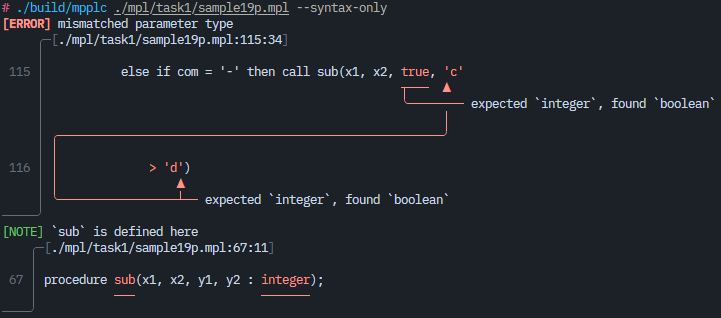
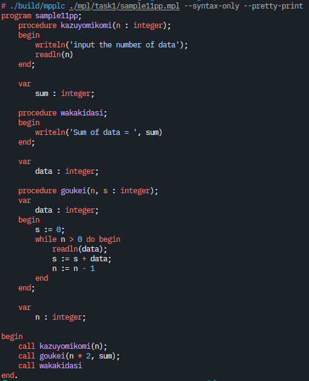

# 言語処理プログラミング実装

このリポジトリは作者が2021年に受講した京都工芸繊維大学情報工学課程の[言語処理プログラミング](https://www.syllabus.kit.ac.jp/archive/?c=detail&pk=1157&schedule_code=12221202&yr=2021&sk=99&sn=%E8%A8%80%E8%AA%9E%E5%87%A6%E7%90%86%E3%83%97%E3%83%AD%E3%82%B0%E3%83%A9%E3%83%9F%E3%83%B3%E3%82%B0)の成果物にアレンジを加えたものを置いているリポジトリです。

## ビルド方法

```bash
git clone https://github.com/shouth/LanguageProcessing
cd LanguageProcessing
cmake -S . -B build
cmake --build ./build # 最終成果物として ./build/mpplc が生成されます
```

## 機能

```
$ ./build/mpplc --help
Usage: ./build/mpplc [OPTIONS] INPUT
Options:
    --pretty-print  Pretty print the input file
    --syntax-only   Check syntax only
    --emit-llvm     Emit LLVM IR
    --emit-casl2    Emit CASL2
    --help          Print this help message
```

### エラー出力

カッコいい(主観)エラーメッセージが出力されます。下の画像のは極端な例だけど。  
実装は[report.c](https://github.com/shouth/LanguageProcessing/blob/main/src/report.c)にはいってます。

フォーマット自体は[Ariadne](https://github.com/zesterer/ariadne)のものを参考…というかほぼそのまま使ってます。実装は何も見ずに一から自分でやった。



### プリティプリント

プリティプリントができます。しかも色付き。



### LLVM IR

講義ではコンパイル先の言語としてCASL2で出力を行いますが、このコンパイラにはLLVM IRを出力する機能もついてます。

```bash
./build/mpplc --emit-llvm [mpplファイル]
# mpplファイルと同じディレクトリにLLVM IRのファイルができる
```

こんな感じのファイルが出力されます。

```llvm
declare {i16, i1} @llvm.sadd.with.overflow.i16(i16, i16)
declare {i16, i1} @llvm.ssub.with.overflow.i16(i16, i16)
declare {i16, i1} @llvm.smul.with.overflow.i16(i16, i16)

declare i32 @getchar()
declare i32 @printf(ptr, ...)
declare i32 @scanf(ptr, ...)
declare void @exit(i32)

@x = common global i16 0
@high = common global i16 0
@low = common global i16 0
@mid = common global i16 0
@can = common global i16 0

define i32 @main() {
  call i32 @printf(ptr @.str0)
  store i8 0, ptr @x
  call i32 @scanf(ptr @.format.integer, ptr @x)
  call i32 @scanf(ptr @.format.line)
  call i32 @getchar()
  %.t2 = load i16, ptr @x
  %.t3 = add i16 0, 0
  %.t1 = icmp slt i16 %.t2, %.t3
  br i1 %.t1, label %l2, label %l3

l2:
  call i32 @printf(ptr @.str1)
  br label %l1

l3:
  %.t4 = add i16 0, 0
  store i16 %.t4, ptr @low
  %.t5 = add i16 0, 181
  store i16 %.t5, ptr @high
  br label %l4

; 以下省略
```

生成されたLLVM IRのファイルをclangでコンパイルすればネイティブのプログラムが作れます。target tripleを埋め込んでないのでコンパイル時に警告が出てしまうのはご愛敬ということで。

```bash
clang [上のコマンドで生成されたLLVM IRファイル]
```

## 内部実装

マルチパスのコンパイラです。

1. 構文木の生成([parser.c](https://github.com/shouth/LanguageProcessing/blob/main/src/parser.c))
2. 名前解決([resolver.c](https://github.com/shouth/LanguageProcessing/blob/main/src/resolver.c))
3. 文法チェック([checker.c](https://github.com/shouth/LanguageProcessing/blob/main/src/resolver.c))
4. コード生成([codegen_casl2.c](https://github.com/shouth/LanguageProcessing/blob/main/src/codegen_casl2.c), [codegen_llvm.c](https://github.com/shouth/LanguageProcessing/blob/main/src/codegen_llvm.c))

の順に処理が進みます。講義ではワンパスで実装する形で進行していきますが、私は講義を受けていた当時もマルチパスで実装していました。

あとコンパイルオプションに `-std=c89 -pedantic-errors` を指定するという縛りを設けています。

### データ構造

可変長配列([array.c](https://github.com/shouth/LanguageProcessing/blob/main/src/array.c))とハッシュテーブル([map.c](https://github.com/shouth/LanguageProcessing/blob/main/src/map.c))を自作してます。可変長配列の方はまあ…特に面白味もないありふれた感じの実装です。

ハッシュテーブルの実装では[hopscotch hashing](https://en.wikipedia.org/wiki/Hopscotch_hashing)というアルゴリズムを使っています。ハッシュテーブルのアルゴリズムには大きく分けてチェイン法とオープンアドレス法の二つがありますが、このhopscotch hashingはチェイン法とオープンアドレス法をいい感じに統合したアルゴリズムになっています。ハッシュテーブルの充填率が高くなっても性能が落ちないこともあり、作者はこのアルゴリズムが好きです。

ハッシュテーブルは要素のハッシュ値をもとに格納する位置を定めるため、格納する位置の衝突を避けるためにも、ハッシュ値はできるだけ偏りなくばらけてくれると嬉しいです。そこでハッシュ値を計算するハッシュアルゴリズムとして[FNV-1a](https://en.wikipedia.org/wiki/Fowler%E2%80%93Noll%E2%80%93Vo_hash_function)を使用しています。[実装が簡単](https://github.com/shouth/LanguageProcessing/blob/e3d85656d52308ffc2013ce097b4423c6adeb290/src/utility.c#L28-L38)なのになんかええ感じに値がばらけてくれているっぽいのでなんかこう…嬉しい感じです。雪崩効果っていうらしい。

```c
#define FNV1A_INIT 0x811C9DC5ul

unsigned long fnv1a(unsigned long hash, const void *ptr, unsigned long len)
{
  const unsigned char *data  = ptr;
  const unsigned char *end   = data + len;
  const unsigned long  prime = 0x01000193ul;

  for (; data < end; ++data) {
    hash = (hash ^ *data) * prime;
  }
  return 0xFFFFFFFFul & hash;
}
```

高速なハッシュアルゴリズムとしては[xxHash](https://xxhash.com)があります。ハッシュアルゴリズムを選定するときにこちらも考慮に一応いれてみましたが、実装が込み入っていて自分の実装に取り込むのはかなり手間がかかりそうだったのでやめておきました。他にも読んだうえで取り込んだらライセンスとかの問題もあるし。

FNV-1aとxxHashそれぞれに対して手元で軽くベンチマークを取ってみたのですが、ハッシュ値の計算対象となるデータが極めて小さい場合はFNV-1aの方が速いっぽいです。逆に大きい場合はxxHashの圧勝でした。まあベンチマークのやり方が悪かった可能性もありますが、FNV-1aはハッシュテーブル向けのアルゴリズムであるように思います。

### 構文木

Red Green Treeという[roslyn](https://github.com/dotnet/roslyn)で発明されたらしきものを使ってます。より厳密にはRed Green Treeが[rust-analyzer](https://github.com/rust-lang/rust-analyzer)で改良されたあとに[biome](https://github.com/biomejs/biome)でさらに改良されたものと似たような感じのものを導入してみました。rust-analyzerのドキュメントに[解説](https://github.com/rust-lang/rust-analyzer/blob/master/docs/dev/syntax.md)があるのでよろしければ参照ください。

Red Green Tree(の改良版)は

1. トークンと文法の構造を、親から子の向きにリンクする形で保持する木
2. トークンのファイル内での位置を保持し、子から親の向きのリンクを提供する木
3. 文法ごとに異なる型を提供する木

の三層からなる木構造で構成されています。メモリ上に保持されるのは基本的に1の木構造のみで、2と3の木構造は必要に応じてその場で生成されたり消去されたりします。このような構造とすることで、シンタックスシュガーを脱糖したりなど木構造そのものに変更を与えたい時には1の木構造にパッチを当て、またリンターのルールの検査を行いたい場合には2の木構造を利用して上下方向に木構造をトラバースし、文法ごとに異なる処理を行いたい場合には3の木構造で型毎に異なる処理を実装するというように柔軟な運用ができる利点があるようです。

実際に導入してみての所感としては、エラーメッセージを出力する際の位置情報の取り扱いがとても簡単にできて嬉しい印象がありました。一方、少なからずCでコンパイラを実装する場合には、必要に応じて木構造を生成したり消去したりする部分のコードの記述が煩雑になってしまったり、3の木構造で各文法に型を持たせても利点が実感しにくいような印象もあります。もう少し実装方法について考えてみても良かったかもしれません。

### エラーメッセージ

気合で実装しました。仮想ターミナルっぽいもの([canvas.c](https://github.com/shouth/LanguageProcessing/blob/main/src/canvas.c))を用意して、その上に出力していく([report.c](https://github.com/shouth/LanguageProcessing/blob/main/src/report.c))方法を取りました。ガチで気合で実装したのでアルゴリズムもへったくれもないです。めちゃくちゃ大変だった…

メッセージ出力を[box-drawing character](https://en.wikipedia.org/wiki/Box-drawing_character)を用いてリッチにしている都合上、簡易的にUTF-8を処理する仕組みが導入してあります。

### コード生成(CASL2)

レジスタ割り付けをちょっとだけ最適化してスタックへの値の出し入れが少なくなるようにしてあります。地味に実装が難しかった…

### コード生成(LLVM)

就活が嫌すぎて現実逃避の一環でできてしまった代物。[CFG](https://en.wikipedia.org/wiki/Control-flow_graph)の理解があったこともあり二日ぐらいで実装できてしまった。すごいことをしてるっぽく見える部分ですが実際は指定のフォーマットに従ってコードを吐いていくだけなのでCASL2の生成よりも圧倒的に楽です。レジスタ割り付けとかも考える必要ないし。
